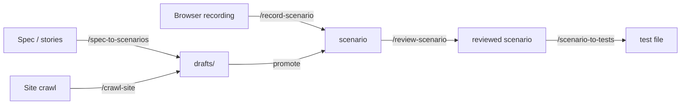

# Workflow

## The pipeline

Every scenario flows through the same pipeline, regardless of how it's created:



## Decision tree

| If you... | Start with |
|-----------|------------|
| Have a written QA spec or user stories | `/spec-to-scenarios` — evaluates the doc, then converts testable cases into scenario markdown |
| Know the flow but have no spec | `/record-scenario` — opens a browser, you demonstrate the flow, markdown is written |
| Don't know what flows exist yet | `/crawl-site` — Claude explores the site autonomously and proposes flows |
| Have a scenario and want to verify it | `/review-scenario` — audits claims against the live site, tightens assertions |
| Have a reviewed scenario and want tests | `/scenario-to-tests` — generates Kotlin/TypeScript/Python test code |
| Want to see overall health | `/scenario-status` — dashboard of review dates, test staleness, coverage gaps |

## Step by step

### 1. Seed scenarios

Three entry points, depending on what you're starting from:

=== "From a spec"

    ```
    /spec-to-scenarios path/to/checkout-spec.md
    ```

    1. Runs `evaluate-spec` to classify each test case (direct, needs changes, out of scope).
    2. Pauses for you to review the evaluation.
    3. Converts testable cases into scenario markdown files under `<scenario_dir>/drafts/`.
    4. Reports what was converted, what was skipped, and what needs manual attention.

=== "From a browser recording"

    ```
    /record-scenario checkout-flow
    ```

    1. Prompts for a start URL.
    2. Opens Playwright codegen — you drive the browser.
    3. Converts the recording into a scenario file.
    4. Auto-chains into `/review-scenario` (unless `--no-review`).

=== "From a site crawl"

    ```
    /crawl-site https://bookstore.example.com
    ```

    1. Navigates the start page, inventories links and interactive elements.
    2. Groups them into user flows (nav items, hero CTAs, auth gates, footer).
    3. Walks each flow one hop (read-only — never fills forms).
    4. Writes draft scenarios to `<scenario_dir>/drafts/`.

### 2. Promote drafts

Drafts from `/crawl-site` and `/spec-to-scenarios` live under `<scenario_dir>/drafts/`. Commands skip them by default. When a draft is ready:

```bash
mv src/test/scenarios/drafts/checkout-flow.md src/test/scenarios/checkout-flow.md
```

Or pass `--include-drafts` to process them in place.

### 3. Review against the live site

```
/review-scenario checkout-flow
```

1. Opens the URL via `playwright-cli`.
2. Walks each test case and records observations.
3. Tags findings by severity: broken, vague, missing-coverage, style.
4. Launches parallel subagents to rewrite the scenario with fixes.
5. Reports a summary table of what changed.

!!! tip
    Always review before generating tests. Scenarios written from specs or recordings often contain claims that don't match the live site.

### 4. Generate tests

```
/scenario-to-tests checkout-flow
```

1. Resolves config (test directory, language, framework, base class).
2. Explores the live site to observe actual behavior.
3. Generates one test file per scenario.
4. Runs the tests and fixes failures.

Use `--dry-run` to write the files without running them.

### 5. Monitor health

```
/scenario-status
```

Shows a dashboard of every scenario with review dates, test file staleness, pass/fail status, and coverage gaps vs. the crawl inventory. Suggests the most impactful next actions.

## Fixture workflow

When scenarios share test data (personas, addresses, payment details):

1. **Create a fixture:** `/generate-fixture interactive --name=returning-customer`
2. **Reference it in scenarios:** `**Fixture:** fixtures/returning-customer`
3. **Branch for alternate paths:** `**Branch:** shipping.country = CA`

Fixtures are JSON files under `<scenario_dir>/fixtures/`. See the `fixture-format` skill for the schema.
